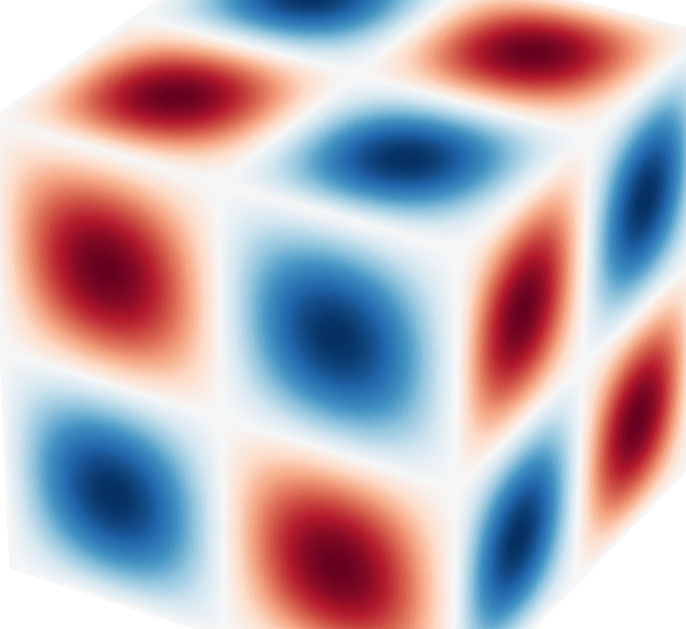
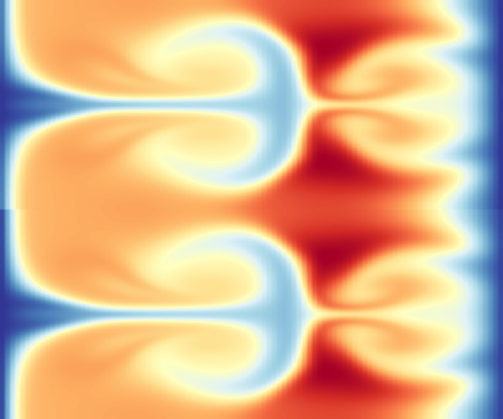
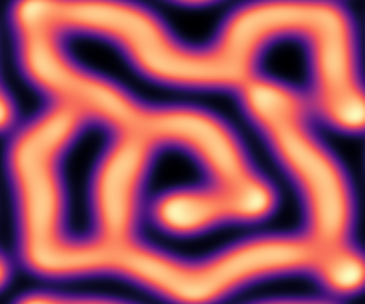
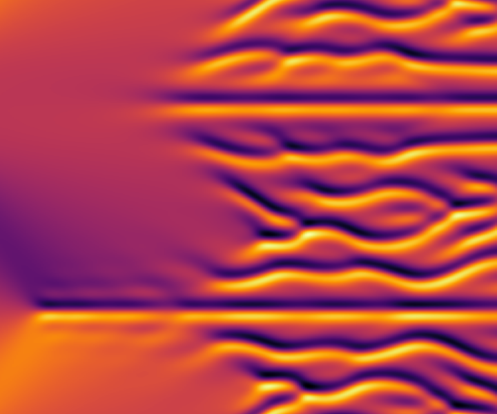
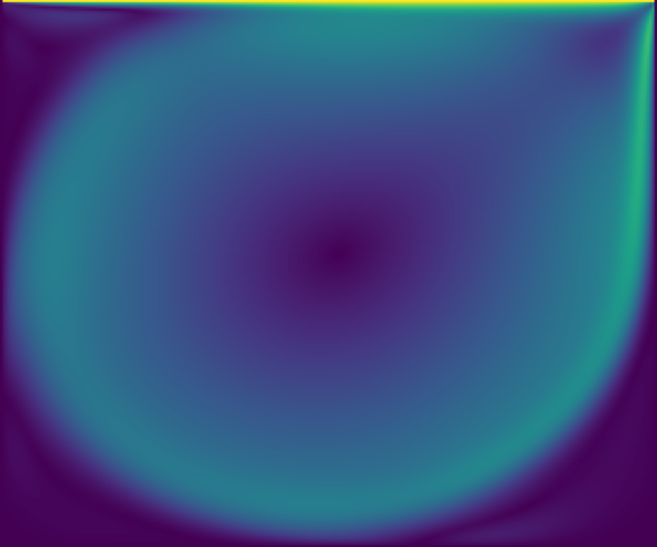

# JAXPI2

[](https://sifanexisted.github.io/jaxpi2/)
[](https://github.com/sifanexisted/jaxpi2/actions/workflows/docs.yml)
[](https://github.com/sifanexisted/jaxpi2/actions/workflows/tests.yml)
[](https://github.com/sifanexisted/jaxpi2/blob/main/pyproject.toml)
[](https://github.com/sifanexisted/jaxpi2/blob/main/LICENSE)
[](https://arxiv.org/abs/2604.23528)
[](https://arxiv.org/abs/2502.00604)

**[📖 Documentation & Examples Gallery](https://sifanexisted.github.io/jaxpi2/)**

This repository is a comprehensive implementation of physics-informed neural networks (PINNs),
seamlessly integrating several advanced network architectures, training algorithms from these papers

- [When PINNs Go Wrong: Pseudo-Time Stepping Against Spurious Solutions](https://arxiv.org/abs/2604.23528v1)
- [Gradient Alignment in Physics-informed Neural Networks: A Second-Order Optimization Perspective](https://arxiv.org/abs/2502.00604)
- [Understanding and Mitigating Gradient Flow Pathologies in Physics-Informed Neural Networks](https://epubs.siam.org/doi/10.1137/20M1318043)
- [When and Why PINNs Fail to Train: A Neural Tangent Kernel Perspective](https://www.sciencedirect.com/science/article/pii/S002199912100663X?casa_token=YlzVQK6hGy8AAAAA:bKwMNg70UoeEuisR1cd1KZnR20xspdvYp1dM4jLkl_wfVDX7O1j2IOlGZsYnC4esu7YcMaO_WOIC)
- [Respecting Causality for Training Physics-informed Neural Networks](https://www.sciencedirect.com/science/article/pii/S0045782524000690)
- [Random Weight Factorization Improves the Training of Continuous Neural Representations](https://arxiv.org/abs/2210.01274)
- [On the Eigenvector Bias of Fourier Feature Networks: From Regression to Solving Multi-Scale PDEs with Physics-Informed Neural Network](https://www.sciencedirect.com/science/article/abs/pii/S0045782521002759)
- [PirateNets: Physics-informed Deep Learning with Residual Adaptive Networks](https://arxiv.org/abs/2402.00326)
- [Fourier Features Let Networks Learn High Frequency Functions in Low Dimensional Domains](https://arxiv.org/abs/2006.10739)
- [A Method for Representing Periodic Functions and Enforcing Exactly Periodic Boundary Conditions with Deep Neural Networks](https://www.sciencedirect.com/science/article/abs/pii/S0021999121001376)
- [Characterizing Possible Failure Modes in Physics-Informed Neural Networks](https://arxiv.org/abs/2109.01050)

This repository also releases an extensive range of benchmarking examples, showcasing the effectiveness
and robustness of our implementation. Training supports both **single** and **multi-GPU** setups out of
the box (data-parallel via `jax.shard_map`); evaluation is currently limited to single-GPU setups.

## Gallery

<table>
  <tr>
    <td align="center">
      <a href="https://sifanexisted.github.io/jaxpi2/examples/kolmogorov_flow"></a><br>
      <sub><b>Kolmogorov Flow (Re 10⁶)</b></sub>
    </td>
    <td align="center">
      <a href="https://sifanexisted.github.io/jaxpi2/examples/taylor_green"></a><br>
      <sub><b>Taylor–Green Vortex (3D)</b></sub>
    </td>
    <td align="center">
      <a href="https://sifanexisted.github.io/jaxpi2/examples/rayleigh_taylor"></a><br>
      <sub><b>Rayleigh–Taylor</b></sub>
    </td>
    <td align="center">
      <a href="https://sifanexisted.github.io/jaxpi2/examples/gray_scott"></a><br>
      <sub><b>Gray–Scott</b></sub>
    </td>
  </tr>
  <tr>
    <td align="center">
      <a href="https://sifanexisted.github.io/jaxpi2/examples/ginzburg_landau"></a><br>
      <sub><b>Ginzburg–Landau</b></sub>
    </td>
    <td align="center">
      <a href="https://sifanexisted.github.io/jaxpi2/examples/ks"></a><br>
      <sub><b>Kuramoto–Sivashinsky</b></sub>
    </td>
    <td align="center">
      <a href="https://sifanexisted.github.io/jaxpi2/examples/lid_driven_cavity"></a><br>
      <sub><b>Lid-driven Cavity (Re 5000)</b></sub>
    </td>
    <td align="center">
      <a href="https://sifanexisted.github.io/jaxpi2/examples/allen_cahn"></a><br>
      <sub><b>Allen–Cahn</b></sub>
    </td>
  </tr>
</table>

Browse all 16 benchmarks with equations, run commands, and animations in the
[**Examples Gallery**](https://sifanexisted.github.io/jaxpi2/examples/).

## Installation

Requires Python 3.11 or later. The pinned dependencies (JAX 0.10.2, Flax 0.12.3) target Linux with a
local CUDA 13 installation; everything also runs on CPU.

```
git clone https://github.com/sifanexisted/jaxpi2.git
cd jaxpi2
pip install -e .
```

## Library structure

The core package `jaxpi/` is intentionally small; problem-specific physics lives in `examples/`.

| Module | Role |
|---|---|
| `jaxpi/models.py` | `PINN` base classes (`ForwardIVP`, `ForwardBVP`), `create_model` factory, loss weighting, pseudo-time stepping, causal training, sharded multi-GPU step |
| `jaxpi/archs.py` | `Mlp`, `ModifiedMlp`, `PirateNet`, periodic and Fourier embeddings |
| `jaxpi/samplers.py` | Collocation samplers (`UniformSampler`, `MeshSampler`, `TemporalMeshSampler`) |
| `jaxpi/training.py` | Shared training loops: `train_loop`, `train` (single run), `train_time_windows` (forward-in-time curriculum) |
| `jaxpi/evaluator.py` | `BaseEvaluator` for metric logging |
| `jaxpi/checkpointing.py` | Orbax checkpointing, resume helpers |
| `jaxpi/logging.py` | Console logger |

Each example follows the same template: `models.py` (PDE residual and losses), `evaluators.py`
(problem-specific metrics), `main.py` (data, samplers, and a call into the shared trainer),
`configs/` (hyperparameters as `ml_collections` configs), and `eval.ipynb` (post-training analysis).
(`taylor_green` additionally keeps its two training modes in `train.py` / `train_multi_stage.py`.)

Note that `r_net` implementations with multiple residual components must return a **dict**
(e.g. `{"ru": ru, "rv": rv, "rc": rc}`) so that components are matched to their loss and
pseudo-time weights by name.

## Quickstart

We use [Weights & Biases](https://wandb.ai/site) to log and monitor training metrics.
Please ensure you have Weights & Biases installed and properly set up with your account before proceeding.
You can follow the installation guide provided [here](https://docs.wandb.ai/quickstart).

To illustrate how to use our code, we will use the advection equation as an example.
First, navigate to the advection directory within the `examples` folder:

```
cd examples/advection
```

To train the model, specify the configuration file that contains the training settings and hyperparameters:

```
python3 main.py --config=configs/baseline.py
```

Multi-GPU execution is automatic. You can specify the GPUs you want to use with the
`CUDA_VISIBLE_DEVICES` environment variable. For example, to use the first two GPUs (0 and 1):

```
CUDA_VISIBLE_DEVICES=0,1 python3 main.py --config=configs/baseline.py
```

**Note on Memory Usage**: Different models and examples may require varying amounts of GPU memory.
If you encounter an out-of-memory error, you can decrease the batch size using the
`--config.training.batch_size` option.

**Resuming**: All examples support resuming an interrupted run from its latest checkpoint:

```
python3 main.py --config=configs/baseline.py --config.training.resume=True
```

Time-windowed examples (e.g. `ks`, `gray_scott`, `taylor_green`) resume from the last trained
time window.

## Evaluation

Each example ships an `eval.ipynb` notebook that restores the latest checkpoint and computes errors
and plots against the reference solution. Open it from the example directory after training:

```
cd examples/advection
jupyter lab eval.ipynb
```

## Tests

The unit-test suite runs on CPU (with 8 simulated devices to exercise the multi-GPU code paths):

```
pip install -e ".[dev]"
pytest tests/
```

## Citation

    @article{wang2023expert,
      title={An Expert's Guide to Training Physics-informed Neural Networks},
      author={Wang, Sifan and Sankaran, Shyam and Wang, Hanwen and Perdikaris, Paris},
      journal={arXiv preprint arXiv:2308.08468},
      year={2023}
    }

    @article{wang2024piratenets,
      title={Piratenets: Physics-informed deep learning with residual adaptive networks},
      author={Wang, Sifan and Li, Bowen and Chen, Yuhan and Perdikaris, Paris},
      journal={Journal of Machine Learning Research},
      volume={25},
      number={402},
      pages={1--51},
      year={2024}
    }

    @inproceedings{
        wang2025gradient,
        title={Gradient Alignment in Physics-informed Neural Networks: A Second-Order Optimization Perspective},
        author={Sifan Wang and Ananyae Kumar bhartari and Bowen Li and Paris Perdikaris},
        booktitle={The Thirty-ninth Annual Conference on Neural Information Processing Systems},
        year={2025},
        url={https://openreview.net/forum?id=iweeVl1RHU}
    }

    @article{wang2026pinns,
      title={When PINNs Go Wrong: Pseudo-Time Stepping Against Spurious Solutions},
      author={Wang, Sifan and Koohy, Shawn and Lu, Yiping and Perdikaris, Paris},
      journal={arXiv preprint arXiv:2604.23528},
      year={2026}
    }
